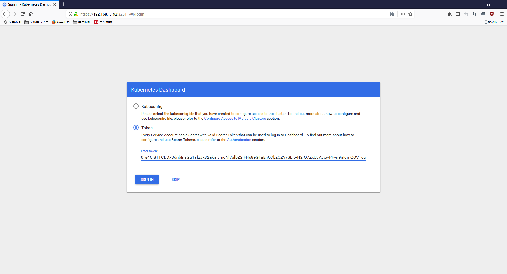
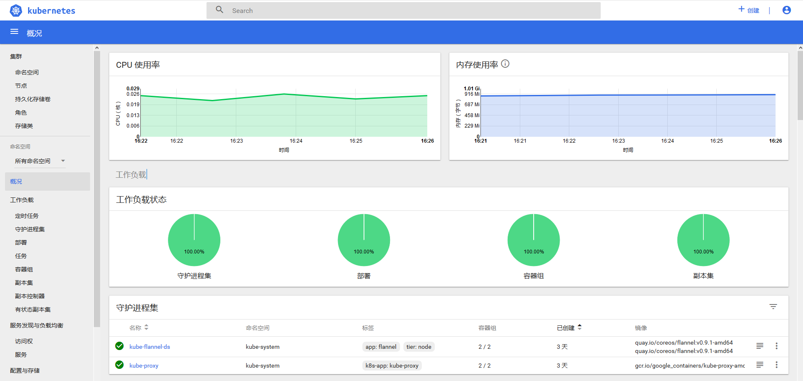

## 安装Dashboard插件

wget https://raw.githubusercontent.com/zxadmin/kubernetes1.9/master/dashboard/kubernetes-dashboard-admin.rbac.yaml

wget https://raw.githubusercontent.com/zxadmin/kubernetes1.9/master/dashboard/kubernetes-dashboard.yaml

kubectl create -f kubernetes-dashboard.yaml

kubectl create -f kubernetes-dashboard-admin.rbac.yaml

### 登陆dashboard

找到kubernete-dashboard-admin的token，用户登录使用

kubectl -n kube-system get secret | grep kubernetes-dashboard-admin

kubernetes-dashboard-admin-token-dfm8b           kubernetes.io/service-account-token   3         9s

可以看到名称是kubernetes-dashboard-admin-token-dfm8b，使用该名称执行如下命令：

kubectl  describe  -n  kube-system secret/kubernetes-dashboard-admin-token-dfm8b

Name:         kubernetes-dashboard-admin-token-dfm8b

Namespace:    kube-system

Labels:       <none>

Annotations:  kubernetes.io/service-account.name=kubernetes-dashboard-admin

              kubernetes.io/service-account.uid=aadc79b1-1b89-11e8-812d-5254002f1f20
			  

Type:  kubernetes.io/service-account-token

Data

====

ca.crt:     1025 bytes

namespace:  11 bytes

token:      eyJhbGciOiJSUzI1NiIsInR5cCI6IkpXVCJ9.eyJpc3MiOiJrdWJlcm5ldGVzL3NlcnZpY2VhY2NvdW50Iiwia3ViZXJuZXRlcy5pby9zZXJ2aWNlYWNjb3VudC9uYW1lc3BhY2UiOiJrdWJlLXN5c3RlbSIsImt1YmVybmV0ZXMuaW8vc2VydmljZWFjY291bnQvc2VjcmV0Lm5hbWUiOiJrdWJlcm5ldGVzLWRhc2hib2FyZC1hZG1pbi10b2tlbi1kZm04YiIsImt1YmVybmV0ZXMuaW8vc2VydmljZWFjY291bnQvc2VydmljZS1hY2NvdW50Lm5hbWUiOiJrdWJlcm5ldGVzLWRhc2hib2FyZC1hZG1pbiIsImt1YmVybmV0ZXMuaW8vc2VydmljZWFjY291bnQvc2VydmljZS1hY2NvdW50LnVpZCI6ImFhZGM3OWIxLTFiODktMTFlOC04MTJkLTUyNTQwMDJmMWYyMCIsInN1YiI6InN5c3RlbTpzZXJ2aWNlYWNjb3VudDprdWJlLXN5c3RlbTprdWJlcm5ldGVzLWRhc2hib2FyZC1hZG1pbiJ9.KuU_Hb-wy3zTaY8WR5f24bGKd3m-YqHRugIYPuRQNEK2kMUkcwoEnCquc4ZElK3M5RpOerOrcKn5ce0zTuNOG0gdwuvNVw-KE4xSw19DnRD5azaaHTUfGzsjBaGhBW2g4_MXdy_tbWwiefqYkV6fFw40DQ4dUgsnoCcHxxvDeqADayLBGBYurBW1ngNy3qhS9fLJmMXCuecb9ZUpCMxwDq1xx38o1dUPWOlb8CFzA3qgxzPDwnJH-qMTZn2pmu66XPZxtfodHu_qRBGWzBOgMsD1Y9OIBwQEJc65v9aGwm96NHenpZeGftFtHO1UuZITWxm-ksOJbcPe91uMdVYFvQ

记下这串token，等下登录使用，这个token默认是永久的。

[root@k8s-master k8s]# kubectl get svc -n kube-system

NAME                   TYPE        CLUSTER-IP      EXTERNAL-IP   PORT(S)         AGE

kube-dns               ClusterIP   10.96.0.10      <none>        53/UDP,53/TCP   32m

kubernetes-dashboard   NodePort    10.109.204.64   <none>        443:32611/TCP   2m

可以看到它对外的端口为32611

打开火狐浏览器，访问https://192.168.1.192:32611/#!/login，选择令牌，输入刚才的token即可进入。

### 部署heapster插件

[root@k8s-master heapster]# ls

grafana.yaml  heapster-rbac.yaml  heapster.yaml  influxdb.yaml

[root@k8s-master heapster]# kubectl create -f ./

安装完成后，重新登录即可看到。 

